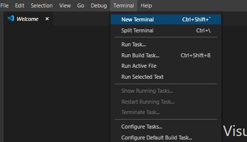

# Firechat

This project was generated with [Angular CLI](https://github.com/angular/angular-cli) version 8.0.3.

## Overview

### what you will learn

### Framework and technology you will use

1. Angular 8
2. BootStrap
3. Firebase
4. Nodejs
5. Html
6. Css
7. Typescript

## Prerequisite

In order to complete the exercise/app you will need to go through the following steps:

<!-- <details> -->

<summary>Step 1 - Installation and local setup</summary>


1. Download [nodejs here](https://github.com/angular/angular-cli) and Install it
2. Download Visual Studio Code [here](https://code.visualstudio.com/Download) and install it
3. Open your *terminal or command prompt or powershell* and install angular CLI by running:

    ```bash
    npm install -g @angular/cli
    ```

4. Create and setup a new angular project by (skipped if you have cloned the project):
   1. navigate to your workspace directory

        ```bash
        cd path/workspace
        ```

   2. create new app by running

        ```bash
        ng new <name-of-your-app>
        ```

   3. open the prject in visual studio code by running

        ```bash
        code <name-of-your-app>
        ```

   4. open terminal in your visual studio by click terminal on the top menu and choose new terminal on the menu options<br>  

   5. Go to the terminal and install our external libraries - bootstrap and angularfire2 by running:

        ```bash
        # for bootstrap run
        npm install --save @ng-bootstrap/ng-bootstrap
        ```

        ```bash
        # for angularfire2 run
        npm install firebase @angular/fire --save
        ```

        for more details you can go to [angularFire2]() and [ng-bootstrap]()

   6. you can run your app by running:

        ```bash
        ng serve
        ```

<!-- </details> -->

<!-- <details> -->

<summary>Step 2 - Firebase setup</summary>

1. Install firebase by running

    ```bash
    npm install -g firebase
    ```

    ```bash
    npm install -g firebase-tools
    ```

2. Create your app in firebase
   1. Go to firebase console [https://console.firebase.google.com](https://console.firebase.google.com), you will need signin *(with your google account...)* or sign up if you don't have an account
   2. Click/Select New Project and add new project
   3. On the get started page click on the web icon {{image}}
   4. Register your web app and setup hosting
   5. Follow the rest of the steps until you are done

Run

```bash
ng serve
```

for a dev server. Navigate to `http://localhost:4200/`. The app will automatically reload if you change any of the source files.

## Code scaffolding

Run

```bash
ng generate component component-name
```
to generate a new component. You can also use `ng generate directive|pipe|service|class|guard|interface|enum|module`.

## Build

Run

```bash
ng build
```

to build the project. The build artifacts will be stored in the `dist/` directory. Use the `--prod` flag for a production build.

## Further help

To get more help on the Angular CLI use

```bash
ng help
```

 or go check out the [Angular CLI README](https://github.com/angular/angular-cli/blob/master/README.md).

## Author

[Women in Big Data](https://github.com/angular/angular-cli/blob/master/README.md)

## License

